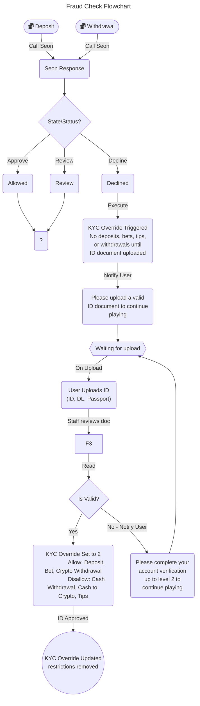

# Fraud

This module contains the submodules that we use to fight fraud and maintain compliance with the laws and regulations of the territories within which we operate.

## KYC Overview

The KYC level for a user can be determined by the verification information they’ve filled out on the site. When a user first registers on our site, they start out with a KYC level of 0. Their level will increase as they complete different levels of verification. There are currently 4 levels

With a KYC level of 0, they have an account but we don't have personal info about them. Users are allowed to update their information and upload documents at any time. However in certain scenarios we may request their documentation manually or automatically via [Seon] rules. As they provide more information, they move up the KYC levels. The KYC levels are as follows:

**📙** All `DECLINED` fraud responses from Seon for users with level 2 rules, lock the user out of tips, withdraws, and deposit systems; it does not lock the accounts. _- See: [Seon API]_

### Level 1 - Identity Collection

KYC form, where the end-user completes their personal information, full name, dob and address. This is the collection of basic information. See `frontend/src/app/components/KycForms`

If a user submits the KYC level 1 form, but any of the conditions below are true, then KYC level 1 will be considered `Incomplete`:

1. The value of a field is less than 2 characters (e.g. the name is filled in with the letter “a”)
2. An invalid address country
3. An invalid DOB (needs to be in this format `DD/MM/YYYY`, and valid date)
4. Under 18 years of age

**📙** Staff can also upload documents for users in the ACP.

### Level 2 - Identity Verification

This is where the end-user uploads a picture of their ID. This is basic validation of data from level 1 with corroborating evidence (government id, passport, etc.).

### Level 3 - Proof of Address

This is where the end-user uploads a picture of their POA (proof of address). This further validates the data from level 1 with corroborating evidence (utility bill, bank statement, etc.).

### Level 4 - Source of Funds

This is where the end-user uploads a picture of their SOF (source of funds). This further validates the data from level 1 with corroborating evidence (pay stub, bank statement, etc.).

## Explanation

The level 1 information must be completed before they can upload documents for KYC levels 2 - 4. However, even though users are able to upload documents at any KYC level after level 1 verification, their KYC level will only increase if the previous level is also complete.

For example, if a user has only completed level 1 verification, they will have a KYC level of 1. If they then upload their level 3 Proof of Address document, and the document has been approved, they will still have a KYC level of 1. To increase their KYC level to 3, they must have their Identity Verification document, level 2, uploaded and approved.

**📙** The only users exempt from this are **admins**, **moderators**, **officers**, **marketing**, and **super admins**. These users are given a KYC level of 4, with all their KYC levels marked as `Completed`, even with possibly no verification information filled out for any of the KYC levels.

There are 4 possible statuses for a user document once it has been uploaded. Those statuses are:

1. Pending
2. Incomplete
3. Completed
4. Rejected

When a user uploads a document, it goes into the `Pending` status. In order for a user’s KYC level to increase, along with the previously stated conditions, their document must have a `Completed` status. Any other status will **not** increase their KYC level.

## Manual Verification

Each KYC level can be manually given to a user in the ACP. Manual Verifying a level will ignore any conditions that a user would usually need to complete to increase their KYC level. For example, if a user’s KYC level 2 was manually verified, then they would not need to upload a document to receive KYC level 2. However, a user’s KYC level will not increase, unless all the previous levels are also completed.

For example, say if a new user registers on our site, and has yet to complete any KYC levels. They will have a KYC level of 0. Now, if someone manually verifies their level 3 KYC in the ACP. That user will still have a KYC level of 0 without also having KYC level 1 and 2 completed. So, if the user were to fill out the appropriate information for level 1 and to have their level 2 document approved, or have them both manually verified, then they would have a KYC level of 3.

## Reset a KYC Level

A user’s KYC level can be reset to a specific level in the ACP, all besides KYC level 0, even if they have approved documents at a level higher than the level being reset to. If a user is reset to a level lower than their current KYC level, any levels that have documents uploaded, at a higher level, will be archived along with it. However, if a level is manually verified in the ACP, then the manual verification will overrule the resetting. You must turn-off manual verification for specific levels if you want to reduce a user's KYC level lower than the level manually verified (of course, the previous levels must also be completed).

## KYC Required Level

The KYC required level represents the minimum KYC level a user must have in order to perform specific actions on our site. These include betting, tipping, deposits, and withdrawals.

For betting and tipping, we require that the user must have KYC level 1 completed before placing bets. After a specific threshold, $1,000,000,000,000, then the user must have KYC level 2 to continue placing bets (it’s possible for this threshold to change in the future). Due to the threshold being so high, concerns for this condition actually triggering aren’t relevant.

If the user’s KYC required level increases, to say level 3, then they must have a KYC level greater than or equal to the required level. If a user’s KYC document is of `Pending` or `Completed` status, and the user’s kyc level is greater than or equal to the required KYC level, then they are able to bet. For tips, their KYC document must be `Completed` in order to give tips to other users.

For withdrawals and deposits, they must have their KYC level greater than or equal to the required level to make any deposits or withdrawals. Deposits and all withdrawals, besides cash withdrawals, are permitted if a user’s KYC document status is of `Pending` or `Completed`. Cash withdrawals must have a document status of `Completed`.

## [Seon]

We use [Seon] for assessing the risk of a user whenever they perform specific actions on our site. These include: tipping, cash or crypto deposits, cash or crypto withdrawals, user sign-up, and when saving their level 1 KYC information. User accounts can be locked if they are seen as being “high-risk” in some cases. As far as KYC, a user’s required KYC level will be increased to 2, if there is suspicion of money laundering happening with deposits or withdrawals. The conditions for how these anti-money laundering rules can trigger can be found in the [Seon ACP].

Go to [Seon ACP] -> Scoring Engine -> Custom Rules

## [Document Review]

A user document can be uploaded by either a user on our site, or by a staff member who has access to the ACP. For most cases, the user should be uploading documents. Either way, any document uploaded is held until a staff member can review to verify the documents submitted are valid, accurate, and trustworthy. If the document is rejected by staff, then the document will be reflected to the user as `Rejected` in the `Verification` tab, and their KYC level would not increase. If a document is accepted, then their document will be approved and their KYC level is eligible for increasing (the previous level must be completed first).

## Diagrams

[Seon]: https://seon.io 'Seon Website'
[Seon API]: https://docs.seon.io/api-reference/introduction 'Seon API Documentation'
[Seon ACP]: https://login.seon.io 'Login to Seon ACP'

## Related Chats

### Gio P. & Lucas M.

#### Via Slack DMs from 17-AUG-2023 to 18-AUG-2023

**Lucas M**

- Hello Gio, got your email.
- Sure, let me know whenever you're available to discuss the KYC lvls.

**Gio**

- Now that I now Lucas M is Lucas R, we can probably do this async over slack, let me know which is best for you.
- I want to understand and document the levels with the system and your expected process for those systems. The user and fraud systems aren’t very well integrated at this point and I’ll likely use this ticket as a catalyst for some additional cleanup and cohesion work.
- Can you start by sharing the levels with me? What is verified at each level and how is that allowed to happen?

**Lucas M**

- Yeah, still not sure why I got Lucas R on my user. lol
- Sure thing, let me explain briefly and then we can dive into details depending on your questions:

  KYC Level 1 = KYC form, where the end-user completes their personal information, full name, dob and address.

  KYC Level 2 = where the end-user uploads a picture of their ID.

  KYC Level 3 = where the end-user uploads a picture of their POA (proof of address).

  KYC Level 4 = where the end-user uploads a picture of their SOF (source of funds).

- Users are allowed to update their information and upload documents at any time. However in certain scenarios we may request their documentation manually or automatically via Seon rules.

**Gio**

- Thank you, that makes sense. What are the basic restrictions, if any, imposed at each level when suspect behavior is not detected?

**Lucas M**

- Okay, so for non-suspected behavior we would consider only when the kyc required level is manually updated to 2 OR Seon rules related to the KYC thresholds are triggered.
- I'm trying to find the file the dev team created with the current logic, Chance shared with us a couple months ago.

**Gio**

- Is that the Google doc I linked in the ticket?

**Lucas M**

- Yes, that's it. That's the current logic, which we would like to maintain for when a suspected behavior is NOT detected.

**Gio**

- Should a Seon response ever increase the required KYC level automatically?

**Lucas M**

- Yes, on all cases it should increase to level 2. To have the user ID requested. Therefore on the front end the notification message appears asking users to complete verification level 2

**Lucas M**

- We will work on improving the user experience for declines to get the messages more custom based on the decline reasons/rules.
- But for now only keeping the restrictions on the suspicious fraud related transactions is good enough.

**Gio**

- Hey Lucas, so far we only act on the Seon overall state or `Approve`, `Review` or `Decline` and I think what we’re describing here is a our first ‘next level’ check that auto-triggers a Level 2 requirement if any applied rule was a Level 2 Threshold AND that rule was ALSO `Decline`. Is that accurate?
- I’m not sure if you have GitHub access, but if you do you can check out the consolidated document for this at https://github.com/project-atl/backend/blob/PD-2574-KYC-flow-Seon-declined/src/modules/fraud/README.md

**Lucas M**

- That's accurate Gio! Apologies for the delay, I was traveling this weekend, couldn't open the link to check and confirm.
- But I don't have access to GitHub
- So apart from the transaction state, we now want to differentiate the actions based on the rule names (text) containing for that case "KYC Level 2 Threshold" for example.

**Gio**

- I hope your travels were easy ones. Thanks for the clarity!
- Do we want this rule interrogation to happen only when the top-level transaction state is `Decline`?

**Lucas M**

- Yes

**Gio**

- Gotcha! Okay, I think I have what I need for a solution. Thank you for working through this with me. I’ll develop a better understanding of these systems and be able to help faster in the future.

**Lucas M**

- Anytime and happy to help! Thank you! 💙
