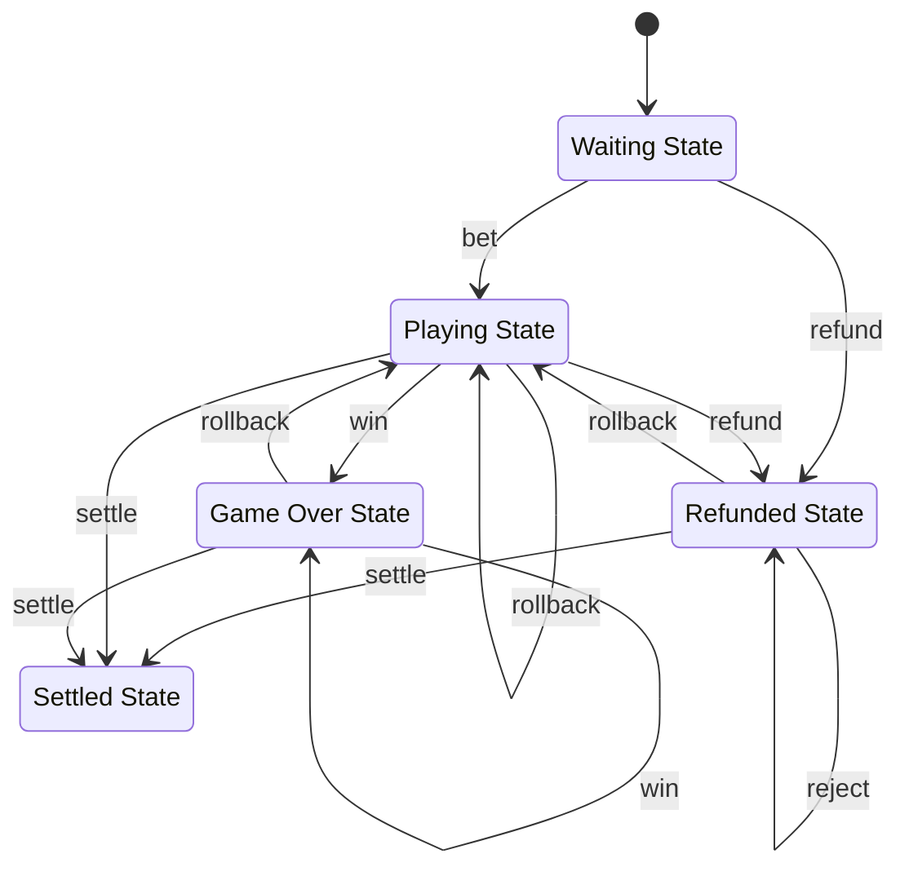

# Slotegrator

At the moment, we are using Slotegrator _ONLY_ for Betby Sportsbook. There are some assumptions in the code related to this.
If we would like to support more providers and games, some additional code changes may be necessary.

## Starting a Session

A session, or a game instance, is started using the `tpGameStartGame` mutation defined in the `tp-games` module.
This mutation calls the `sportsbooks/init` Slotegrator API endpoint to request a game URL, and returns it directly to the frontend, where it used to either redirect the page, or embed an iFrame, depending on the user's viewport.

## Callbacks

Other than initializing a game session, we only communicate with Slotegrator via callbacks. The supported callbacks can be found in the [callback router](./routes/callbacks.ts).

Any given callback may be sent multiple times, and as such, our business logic must be idempotent. Unlike our other providers, Slotegrator expects us to return an error response when callbacks are sent out of order.
The FSM detailed below is responsible for handling request order.

Slotegrator has confirmed the following transitions:

bet -> win=0/win>0
bet -> refund
win -> rollback
refund -> settle
win -> settle

## Finite State Machine

We are leveraging [xstate](https://xstate.js.org/docs/about/concepts.html) to model and execute incoming Slotegrator actions (callbacks).
Below is a visualization of our current machine with includes all states, events and actions.

The state machine lets us cleanly handle events in order, regardless of the order in which we receive them.
A long term goal is to refactor the existing providers to use a very similar (if not the same) machine.
The actions will differ, but the states should be the same.



The state machine code can be found in [./lib/fsm.ts](./lib/fsm.ts)

### State Machine Visualization

For ease of comprehension, the state machine can be visualized using the [xstate visualizer](https://stately.ai/viz) and the `createMachine` function code in [./lib/fsm.ts](./lib/fsm.ts).

## Q&As from Technical Team

This is a list of questions and answers we got from Slotegrator's technical team. Pasting here incase it is helpful for anyone.

1. What is a session? There is an explicit webhook for closing the session, but as far as we can tell, nothing that signifies the beginning of a session. What does it mean to close a session?

- First of all, sessionID its unique identifier for some specific gamelaunch/gamesession.
  It should be unique. Session start = launch request from you to our side.

- For Betby sportsbook there is no any callback on session close. On our side we are closing session after 3 hours of inactivity. Warning! session should remain open for WIN/refund/rollback requests, so we could deliver request that stuck for some reason.

- Each game sessionid should be unique value, you need to create new value, each time some player try to launch betting.
  Actually it helps to identify timeframe where was some error or betslip in caase of some questions.

2. What is the difference between a rollback & a refund?

- refund in general act only with bet transactions or it could be used when customer triggers cashout for some betslip, and rollback in general is used to "fix" win amount in case of some changes in match.

3. What is the difference between the settle & win callbacks?

- settle - its kind of final win that closes betslip, and you are not allowed to make any changes in it after this call.

4. What is a betslip?

- betslip its kind of round in slot games, so its like set of bet/win request bounded together.

## Running Locally

```sh
ngrok http --subdomain=elder-slotegrator 3003
```
